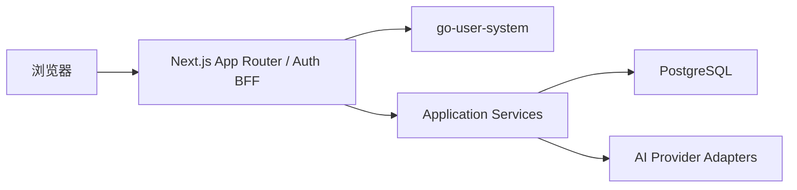

# 技术架构

> 最后核对：**2026-10-04**（本轮修订）。
> 本行**只在内容变更时**更新，不随改名/格式化变动——约定见 [CONTRIBUTING.md](../CONTRIBUTING.md)「目录与命名约定」。

## 1. 架构结论

首版采用单仓库、单 Next.js 应用、单 PostgreSQL 数据库。

本项目使用 **Next.js `16.3.1`**（见 `package.json` 的 `dependencies.next`，`node_modules` 实测同版本）。

> 2026-10-04 更正：本文原先写「应选择 16.2 的最新安全补丁，而不是 16.3 Preview」。
> 实测该指引**从未被遵循过**——`git log -S` 显示 `"next": "16.3.1"` 是在基线提交
> `667241f`（`feat: establish KnowTrace MVP baseline`）一次性写定的，仓库里**从未存在过
> 16.2 的版本记录**。所以这不是「升到了 16.3」，而是「选型文档与实际依赖从一开始就不一致」。
> 因此不补 ADR（没有一次可记录的升级决策），直接以依赖为准修正本文。

**依赖升级的纪律**：以 `package.json` 与锁文件为唯一事实源；本文只描述**架构含义**，
不重复版本号。若某次升级改变了架构含义（例如 App Router 契约、构建输出结构），
再补一条 ADR 记录取舍。



## 2. 选择全栈 TypeScript 的原因

### 问题

首版功能集中在记录、分类、AI 调用和简单页面，如果同时维护独立前端和 Go/Python API，会产生重复 DTO、接口和部署工作。

### 修改建议

使用 Next.js App Router 直接完成 UI 和服务端能力，业务规则放入与框架隔离的 Application Service。需要 App 或独立后端时，再通过 Route Handler 或新服务复用/迁移这些规则。

### 取舍

优点：

- 更快形成可使用版本。
- 前后端共享 TypeScript 类型和 Zod Schema。
- 单容器应用加数据库即可部署。

代价：

- 当前项目不再以 Go 后端训练为主要目标。
- 必须防止 Server Action、组件和数据库查询互相耦合。
- 长任务不能依赖普通 Server Action 无限等待。

## 3. Next.js 数据模式

- 页面首次读取：Server Component 直接调用 Query Service。
- 表单和 UI 修改：Server Action 调用 Command Service。
- Client Component 只负责需要交互状态的局部区域。
- 健康检查、Webhook、未来 App API：Route Handler。
- 默认 Node.js Runtime；数据库和 AI SDK 不使用 Edge Runtime。
- 动态 `params`、`searchParams`、`cookies`、`headers` 按当前异步 API 使用。

## 4. 推荐目录

> [!NOTE]
> **以下目录树写于实施之前，是规划态，不是当前实际结构。**保留它是为了记录当初的
> 分层意图（Page → Server Action → Feature → Repository 的依赖方向），**不要逐条核对路径**。
>
> 实际结构与它的主要差异：
>
> - 没有 route group，`src/app/` 下是 `captures/`、`categories/`、`claims/`、`subjects/`、
>   `search/`、`account/`、`archived/`、`data-transfer/`、`login/`、`register/` 等直接路由。
> - `src/features/` 实际有 13 个域：`ai-processing`、`api`、`auth`、`capture`、`claims`、
>   `classification`、`data-transfer`、`reliability`、`search`、`similarity`、`subjects`、
>   `topic-synthesis`、`workspace`，比规划多出 `reliability`、`similarity`、
>   `topic-synthesis`、`workspace`、`api`、`auth` 等。
> - `src/server/` 只有 `ai/` 与 `db/`，规划中的 `config/`、`observability/` 没有落地为独立目录。
> - `tests/` 未集中在顶层，测试与源码同目录或置于各域内。

```text
src/
├── app/
│   ├── (capture)/
│   │   ├── page.tsx
│   │   ├── captures/[id]/page.tsx
│   │   └── categories/[id]/page.tsx
│   ├── api/health/live/route.ts
│   ├── api/health/ready/route.ts
│   ├── error.tsx
│   ├── global-error.tsx
│   └── layout.tsx
├── features/
│   ├── capture/
│   │   ├── actions.ts
│   │   ├── service.ts
│   │   ├── repository.ts
│   │   ├── schema.ts
│   │   └── components/
│   ├── classification/
│   └── ai-processing/
├── server/
│   ├── db/
│   ├── ai/
│   │   ├── provider.ts
│   │   ├── openai.ts
│   │   └── deepseek.ts
│   ├── config/
│   └── observability/
└── shared/
    ├── errors/
    └── validation/

drizzle/
tests/
docs/
```

## 5. 依赖方向

```text
Page / Component
→ Server Action / Query
→ Application Service
→ Repository / Provider Port
→ Drizzle / Vendor SDK
```

禁止：

- Client Component 导入数据库模块。
- React 组件直接执行 Drizzle 查询。
- Server Action 保存供应商 SDK 原始对象。
- Provider Adapter 更新 Capture。
- Repository 返回 Next.js Response。

### 5.1 Workspace 是横切的数据边界

所有可归属的业务行都带 `workspace_id`（`captures` / `categories` / `data_import_runs` /
`data_import_objects` / `ai_processing_runs` / `topic_syntheses`）。数据访问层在解析身份之后
必须先解析 Workspace，并且**每条查询都显式带 `eq(<表>.workspaceId, scope.workspaceId)`**
（见 `src/features/auth/access.ts`）。

隔离**只在应用层强制，数据库未启用 RLS**——所以「新增读写入口时必须带上 workspace 条件」
不是建议而是硬约束，漏一处即跨空间读。为什么不用 RLS、以及被否的其它替代方案，
见 [ADR-0017](adr/0017-workspace-isolation-model.md)。

## 6. AI 调用模式

P0 采用“主动触发、请求内等待、持久化 Run”的简单模式：

```text
创建 running Run
→ 带超时调用 Provider
→ 校验输出
→ 保存 Suggestion
→ 更新 Run
```

以下任一条件出现后迁移到 Worker：

- 模型调用经常超过平台请求时限。
- 需要自动重试或批量处理。
- AI 处理影响页面请求容量。
- 部署平台不保证长请求稳定执行。

## 7. 配置

服务端环境变量：

```text
DATABASE_URL
AUTH_ENABLED
AUTH_SERVICE_URL
AUTH_COOKIE_SECURE
AI_DEFAULT_PROVIDER
OPENAI_API_KEY
OPENAI_MODEL
OPENAI_BASE_URL
DEEPSEEK_API_KEY
DEEPSEEK_MODEL
DEEPSEEK_BASE_URL
AI_REQUEST_TIMEOUT_MS
AI_MAX_INPUT_CHARS
```

Provider Base URL 使用代码内受控默认值或服务端白名单。浏览器只可为 CC-Switch 模式传入 `localhost`、回环地址或 `host.docker.internal`，服务端规范化为 `/v1`；其他任意 URL 均拒绝。默认跟随模式经 `/v1/messages` 进入 CC-Switch，由它把请求转发给当前供应商；KnowTrace-Workflow 对返回的 JSON 再做应用 Schema 校验。

UI 提供的 API Key 通过 Server Action 仅传入本次 Provider 调用，不参与输入哈希，不写入数据库、Run、Suggestion 或日志。用户可选择把凭据保存在当前标签页的 `sessionStorage`，默认不保存。

## 8. 部署

Docker 自托管使用 Next.js standalone output：

```js
const nextConfig = {
  output: 'standalone',
}
```

KnowTrace-Workflow Compose 服务：

```text
app
postgres
```

首版单实例，不引入 Redis、消息队列和共享 ISR Cache。页面以动态数据读取为主，避免为简单内部工具增加复杂缓存一致性问题。

认证采用仓库内 `services/go-user-system` 的独立运行服务（Go、MySQL、Redis），由根级 Compose/Makefile 统一编排。浏览器只访问 KnowTrace-Workflow 同源 BFF，access/refresh token 都保存在 HttpOnly Cookie；Proxy 执行页面前置门禁，Server Action 和私有图片 Route Handler再独立授权。详细边界见 ADR-0013 与 ADR-0014。

## 9. GitHub 项目复用策略

开始编码前可以检查用户现有 GitHub 仓库，但必须先做适配评估：

- 是否已经使用 Next.js App Router。
- 依赖是否仍受支持并无已知严重安全问题。
- 数据模型是否能容纳 Capture、Category 和 AI Run。
- 是否带有难以删除的认证、租户或 SaaS 计费耦合。
- 测试和迁移是否可靠。

优先复用基础 UI、编辑器、数据库配置和部署脚本；不为了“不是从零开始”而继承不匹配的业务模型。
